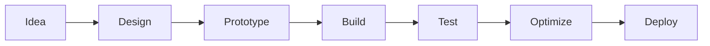

````markdown
<!-- ================================================= -->
<!--            GITHUB PROFILE README (FINAL)          -->
<!-- ================================================= -->

<p align="center">
  
</p>

<h3 align="center">
  Webpage Builder • Figma Plugin Developer • Creative Technologist
</h3>

<p align="center">
  
</p>

---

## 🚀 About Me

```txt
💡 I build modern, functional web experiences
🎨 I develop Figma plugins that automate design workflows
⚙️ I enjoy converting ideas into practical tools
🧠 Curious, hands-on, and always learning
````

---

## 🛠️ What I Specialize In

### 🌐 Webpage Building

* Responsive & accessible UI design
* Frontend logic & performance optimization
* JavaScript & TypeScript-based projects

### 🎨 Figma Plugin Development

* Custom plugin UIs (HTML, CSS, JS)
* Font, text & layout automation
* API & AI-integrated tools
* Productivity-focused design utilities

---

## 💻 Programming Languages

<p align="center">
  
</p>

```text
✔ JavaScript
✔ TypeScript
✔ Python
✔ C
✔ ADA
```

---

## 📦 Featured Projects

<p align="center">
  
  
</p>

<p align="center">
  
  
</p>

---

## 🧠 Development Workflow



---

## 📊 GitHub Stats

<p align="center">
  
  
</p>

<p align="center">
  
</p>

---

## 🧩 Currently Exploring

* Advanced Figma plugin UX patterns
* AI-assisted design automation
* High-performance web applications

---

## 📫 Connect With Me

<p align="center">
  <a href="https://github.com/ADU773">
    
  </a>
  <a href="https://www.linkedin.com/in/advaith-a-arun/">
    
  </a>
  <a href="https://www.instagram.com/advth540/">
    
  </a>
  <a href="mailto:aadvaithofficial@gmail.com">
    
  </a>
</p>

---

<p align="center">
  <sub>⚡ Built with curiosity • Designed with intent • Powered by code</sub>
</p>

<p align="center">
  
</p>
```
